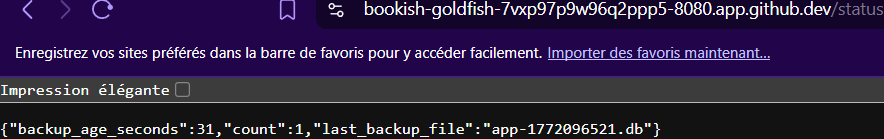

------------------------------------------------------------------------------------------------------
ATELIER PRA/PCA
------------------------------------------------------------------------------------------------------
L’idée en 30 secondes : Cet atelier met en œuvre un **mini-PRA** sur **Kubernetes** en déployant une **application Flask** avec une **base SQLite** stockée sur un **volume persistant (PVC pra-data)** et des **sauvegardes automatiques réalisées chaque minute vers un second volume (PVC pra-backup)** via un **CronJob**. L’**image applicative est construite avec Packer** et le **déploiement orchestré avec Ansible**, tandis que Kubernetes assure la gestion des pods et de la disponibilité applicative. Nous observerons la différence entre **disponibilité** (recréation automatique des pods sans perte de données) et **reprise après sinistre** (perte volontaire du volume de données puis restauration depuis les backups), nous mesurerons concrètement les RTO et RPO, et comprendrons les limites d’un PRA local non répliqué. Cet atelier illustre de manière pratique les principes de continuité et de reprise d’activité, ainsi que le rôle respectif des conteneurs, du stockage persistant et des mécanismes de sauvegarde.
  
**Architecture cible :** Ci-dessous, voici l'architecture cible souhaitée.   
  
  
  
-------------------------------------------------------------------------------------------------------
Séquence 1 : Codespace de Github
-------------------------------------------------------------------------------------------------------
Objectif : Création d'un Codespace Github  
Difficulté : Très facile (~5 minutes)
-------------------------------------------------------------------------------------------------------
**Faites un Fork de ce projet**. Si besoin, voici une vidéo d'accompagnement pour vous aider à "Forker" un Repository Github : [Forker ce projet](https://youtu.be/p33-7XQ29zQ) 
  
Ensuite depuis l'onglet **[CODE]** de votre nouveau Repository, **ouvrez un Codespace Github**.
  
---------------------------------------------------
Séquence 2 : Création du votre environnement de travail
---------------------------------------------------
Objectif : Créer votre environnement de travail  
Difficulté : Simple (~10 minutes)
---------------------------------------------------
Vous allez dans cette séquence mettre en place un cluster Kubernetes K3d contenant un master et 2 workers, installer les logiciels Packer et Ansible. Depuis le terminal de votre Codespace copier/coller les codes ci-dessous étape par étape :  

**Création du cluster K3d**  
```
curl -s https://raw.githubusercontent.com/k3d-io/k3d/main/install.sh | bash
```
```
k3d cluster create pra \
  --servers 1 \
  --agents 2
```
**vérification de la création de votre cluster Kubernetes**  
```
kubectl get nodes
```
**Installation du logiciel Packer (création d'images Docker)**  
```
PACKER_VERSION=1.11.2
curl -fsSL -o /tmp/packer.zip \
  "https://releases.hashicorp.com/packer/${PACKER_VERSION}/packer_${PACKER_VERSION}_linux_amd64.zip"
sudo unzip -o /tmp/packer.zip -d /usr/local/bin
rm -f /tmp/packer.zip
```
**Installation du logiciel Ansible**  
```
python3 -m pip install --user ansible kubernetes PyYAML jinja2
export PATH="$HOME/.local/bin:$PATH"
ansible-galaxy collection install kubernetes.core
```
  
---------------------------------------------------
Séquence 3 : Déploiement de l'infrastructure
---------------------------------------------------
Objectif : Déployer l'infrastructure sur le cluster Kubernetes
Difficulté : Facile (~15 minutes)
---------------------------------------------------  
Nous allons à présent déployer notre infrastructure sur Kubernetes. C'est à dire, créér l'image Docker de notre application Flask avec Packer, déposer l'image dans le cluster Kubernetes et enfin déployer l'infratructure avec Ansible (Création du pod, création des PVC et les scripts des sauvegardes aututomatiques).  

**Création de l'image Docker avec Packer**  
```
packer init .
packer build -var "image_tag=1.0" .
docker images | head
```
  
**Import de l'image Docker dans le cluster Kubernetes**  
```
k3d image import pra/flask-sqlite:1.0 -c pra
```
  
**Déploiment de l'infrastructure dans Kubernetes**  
```
ansible-playbook ansible/playbook.yml
```
  
**Forward du port 8080 qui est le port d'exposition de votre application Flask**  
```
kubectl -n pra port-forward svc/flask 8080:80 >/tmp/web.log 2>&1 &
```
  
---------------------------------------------------  
**Réccupération de l'URL de votre application Flask**. Votre application Flask est déployée sur le cluster K3d. Pour obtenir votre URL cliquez sur l'onglet **[PORTS]** dans votre Codespace (à coté de Terminal) et rendez public votre port 8080 (Visibilité du port). Ouvrez l'URL dans votre navigateur et c'est terminé.  

**Les routes** à votre disposition sont les suivantes :  
1. https://...**/** affichera dans votre navigateur "Bonjour tout le monde !".
2. https://...**/health** pour voir l'état de santé de votre application.
3. https://...**/add?message=test** pour ajouter un message dans votre base de données SQLite.
4. https://...**/count** pour afficher le nombre de messages stockés dans votre base de données SQLite.
5. https://...**/consultation** pour afficher les messages stockés dans votre base de données.
  
---------------------------------------------------  
### Processus de sauvegarde de la BDD SQLite

Grâce à une tâche CRON déployée par Ansible sur le cluster Kubernetes (un CronJob), toutes les minutes une sauvegarde de la BDD SQLite est faite depuis le PVC pra-data vers le PCV pra-backup dans Kubernetes.  

Pour visualiser les sauvegardes périodiques déposées dans le PVC pra-backup, coller les commandes suivantes dans votre terminal Codespace :  

```
kubectl -n pra run debug-backup \
  --rm -it \
  --image=alpine \
  --overrides='
{
  "spec": {
    "containers": [{
      "name": "debug",
      "image": "alpine",
      "command": ["sh"],
      "stdin": true,
      "tty": true,
      "volumeMounts": [{
        "name": "backup",
        "mountPath": "/backup"
      }]
    }],
    "volumes": [{
      "name": "backup",
      "persistentVolumeClaim": {
        "claimName": "pra-backup"
      }
    }]
  }
}'
```
```
ls -lh /backup
```
**Pour sortir du cluster et revenir dans le terminal**
```
exit
```

---------------------------------------------------
Séquence 4 : 💥 Scénarios de crash possibles  
Difficulté : Facile (~30 minutes)
---------------------------------------------------
### 🎬 **Scénario 1 : PCA — Crash du pod**  
Nous allons dans ce scénario **détruire notre Pod Kubernetes**. Ceci simulera par exemple la supression d'un pod accidentellement, ou un pod qui crash, ou un pod redémarré, etc..

**Destruction du pod :** Ci-dessous, la cible de notre scénario   
  
  

Nous perdons donc ici notre application mais pas notre base de données puisque celle-ci est déposée dans le PVC pra-data hors du pod.  

Copier/coller le code suivant dans votre terminal Codespace pour détruire votre pod :
```
kubectl -n pra get pods
```
Notez le nom de votre pod qui est différent pour tout le monde.  
Supprimez votre pod (pensez à remplacer <nom-du-pod-flask> par le nom de votre pod).  
Exemple : kubectl -n pra delete pod flask-7c4fd76955-abcde  
```
kubectl -n pra delete pod <nom-du-pod-flask>
```
**Vérification de la suppression de votre pod**
```
kubectl -n pra get pods
```
👉 **Le pod a été reconstruit sous un autre identifiant**.  
Forward du port 8080 du nouveau service  
```
kubectl -n pra port-forward svc/flask 8080:80 >/tmp/web.log 2>&1 &
```
Observez le résultat en ligne  
https://...**/consultation** -> Vous n'avez perdu aucun message.
  
👉 Kubernetes gère tout seul : Aucun impact sur les données ou sur votre service (PVC conserve la DB et le pod est reconstruit automatiquement) -> **C'est du PCA**. Tout est automatique et il n'y a aucune rupture de service.
  
---------------------------------------------------
### 🎬 **Scénario 2 : PRA - Perte du PVC pra-data** 
Nous allons dans ce scénario **détruire notre PVC pra-data**. C'est à dire nous allons suprimer la base de données en production. Ceci simulera par exemple la corruption de la BDD SQLite, le disque du node perdu, une erreur humaine, etc. 💥 Impact : IL s'agit ici d'un impact important puisque **la BDD est perdue**.  

**Destruction du PVC pra-data :** Ci-dessous, la cible de notre scénario   
  
  

🔥 **PHASE 1 — Simuler le sinistre (perte de la BDD de production)**  
Copier/coller le code suivant dans votre terminal Codespace pour détruire votre base de données :
```
kubectl -n pra scale deployment flask --replicas=0
```
```
kubectl -n pra patch cronjob sqlite-backup -p '{"spec":{"suspend":true}}'
```
```
kubectl -n pra delete job --all
```
```
kubectl -n pra delete pvc pra-data
```
👉 Vous pouvez vérifier votre application en ligne, la base de données est détruite et la service n'est plus accéssible.  

✅ **PHASE 2 — Procédure de restauration**  
Recréer l’infrastructure avec un PVC pra-data vide.  
```
kubectl apply -f k8s/
```
Vérification de votre application en ligne.  
Forward du port 8080 du service pour tester l'application en ligne.  
```
kubectl -n pra port-forward svc/flask 8080:80 >/tmp/web.log 2>&1 &
```
https://...**/count** -> =0.  
https://...**/consultation** Vous avez perdu tous vos messages.  

Retaurez votre BDD depuis le PVC Backup.  
```
kubectl apply -f pra/50-job-restore.yaml
```
👉 Vous pouvez vérifier votre application en ligne, **votre base de données a été restaureé** et tous vos messages sont bien présents.  

Relance des CRON de sauvgardes.  
```
kubectl -n pra patch cronjob sqlite-backup -p '{"spec":{"suspend":false}}'
```
👉 Nous n'avons pas perdu de données mais Kubernetes ne gère pas la restauration tout seul. Nous avons du protéger nos données via des sauvegardes régulières (du PVC pra-data vers le PVC pra-backup). -> **C'est du PRA**. Il s'agit d'une stratégie de sauvegarde avec une procédure de restauration.  

---------------------------------------------------
Séquence 5 : Exercices  
Difficulté : Moyenne (~45 minutes)
---------------------------------------------------
**Complétez et documentez ce fichier README.md** pour répondre aux questions des exercices.  
Faites preuve de pédagogie et soyez clair dans vos explications et procedures de travail.  

**Exercice 1 :**  
Quels sont les composants dont la perte entraîne une perte de données ?  
  
Le seul composant dont la perte entraîne une perte de données est le PVC pra-data, à condition que le PVC pra-backup soit lui aussi perdu (ou que la dernière sauvegarde soit trop ancienne).

Le Pod : Sa suppression est sans conséquence sur l'intégrité des données, celles-ci étant persistées dans le PVC pra-data. Kubernetes assure sa haute disponibilité par une recréation automatique (PCA).

PVC pra-data (Volume de production) : Sa perte critique engendre une interruption de service et la perte des données actives, déclenchant ainsi la procédure de Plan de Reprise d'Activité (PRA).

PVC pra-backup (Volume de sauvegarde) : En cas de perte simultanée avec le volume de production, toute possibilité de restauration est anéantie.

CronJob sqlite-backup : Son absence interrompt le cycle des sauvegardes, ce qui dégrade directement le RPO (perte de données potentielles plus importante entre deux sauvegardes).

**Exercice 2 :**  
Expliquez nous pourquoi nous n'avons pas perdu les données lors de la supression du PVC pra-data  
  
Nous n'avons pas perdu les données car la base de données SQLite n'est pas stockée à l'intérieur du conteneur, mais sur un volume persistant externe : le PVC pra-data.
Quand Kubernetes détruit un pod, il supprime uniquement le conteneur (le processus). Le PVC, lui, est un objet Kubernetes indépendant qui survit à la vie du pod. Lorsque le Deployment recrée automatiquement un nouveau pod, celui-ci monte le même PVC pra-data et retrouve la base de données intacte.
C'est précisément la différence entre le stockage éphémère (dans le conteneur) et le stockage persistant (dans un PVC) : le premier disparaît avec le pod, le second persiste.

**Exercice 3 :**  
Quels sont les RTO et RPO de cette solution ?  
  
RPO (Recovery Point Objective)
Le CronJob effectue une sauvegarde toutes les 1 minute. En cas de sinistre, on peut donc perdre au maximum 1 minute de données (les transactions réalisées entre la dernière sauvegarde et le crash).
RTO (Recovery Time Objective)
La procédure de restauration manuelle comprend plusieurs étapes : scale down du deployment, suppression du PVC, recréation de l'infrastructure (kubectl apply), lancement du job de restauration et relance du CronJob. Ce processus prend environ 5 à 10 minutes si l'opérateur est disponible et connaît la procédure.

**Exercice 4 :**  
Pourquoi cette solution (cet atelier) ne peux pas être utilisé dans un vrai environnement de production ? Que manque-t-il ?   
  
Cette solution est un excellent environnement d'apprentissage, mais elle présente plusieurs limites critiques pour un usage en production :

1. Pas de réplication géographique. Les deux PVCs (pra-data et pra-backup) sont stockés sur le même cluster, probablement sur le même node. Si la machine physique tombe en panne ou si le datacenter est sinistré, les deux volumes sont perdus simultanément.
2. Pas de chiffrement des sauvegardes. Les fichiers SQLite sont copiés en clair. En production, les sauvegardes doivent être chiffrées au repos et en transit.
3. Pas de surveillance ni d'alerting. Il n'y a aucun mécanisme pour détecter qu'une sauvegarde a échoué ou qu'un PVC est presque plein.
4. La restauration est manuelle. Le RTO dépend entièrement de la disponibilité et de la réactivité d'un opérateur humain. Une vraie solution PRA devrait automatiser la détection du sinistre et le déclenchement de la restauration.
5. SQLite n'est pas adapté à la production. SQLite est une base de données mono-fichier, non distribuée et non répliquée. En production, on utilise des bases comme PostgreSQL ou MySQL avec réplication native.
6. Pas de rétention des sauvegardes. Le système ne conserve qu'un seul fichier de backup (ou une liste non gérée). Il n'y a pas de politique de rétention (ex : garder les 7 derniers jours).
  
**Exercice 5 :**  
Proposez une architecture plus robuste.   
  
PostgreSQL en mode HA (via l'opérateur CloudNativePG ou Patroni) remplace SQLite, avec réplication synchrone entre un primary et un ou plusieurs replicas.
Velero pour les sauvegardes Kubernetes : sauvegarde des PVCs, des objets Kubernetes et restauration automatisée, vers un stockage objet externe (S3, MinIO, Azure Blob...).
Deux datacenters distincts (ou deux régions cloud) pour éviter le SPOF géographique.
Un LoadBalancer / DNS failover (ex: Route53 ou un health-check DNS) pour basculer automatiquement le trafic vers le site secondaire.
Monitoring & alerting avec Prometheus + Alertmanager pour détecter un sinistre et déclencher les procédures.
Runbook automatisé (via ArgoCD ou un script CI/CD) pour réduire le RTO à quelques minutes, voire secondes.

Avec cette architecture, on vise un RPO < 1 seconde (réplication synchrone) et un RTO < 5 minutes (basculement automatique).

---------------------------------------------------
Séquence 6 : Ateliers  
Difficulté : Moyenne (~2 heures)
---------------------------------------------------
### **Atelier 1 : Ajoutez une fonctionnalité à votre application**  
**Ajouter une route GET /status** dans votre application qui affiche en JSON :
* count : nombre d’événements en base
* last_backup_file : nom du dernier backup présent dans /backup
* backup_age_seconds : âge du dernier backup



---------------------------------------------------
### **Atelier 2 : Choisir notre point de restauration**  
Aujourd’hui nous restaurobs “le dernier backup”. Nous souhaitons **ajouter la capacité de choisir un point de restauration**.

Par défaut, la restauration utilisait toujours le dernier backup. Cet atelier ajoute la capacité de choisir un point de restauration précis parmi tous les backups du PVC pra-backup. Chaque backup est nommé app-<timestamp_unix>.db et généré toutes les minutes par le CronJob.

Nouveaux fichiers :

app/app.py — Nouvelle route GET /backups qui liste en JSON tous les points de restauration disponibles avec leur nom, date lisible et âge en secondes.
pra/51-job-restore-point.yaml — Job Kubernetes paramétrable via la variable RESTORE_FILE.
pra/restore.sh — Script bash qui orchestre toute la procédure en 3 phases.

Procédure de restauration :

1. Identifier le point de restauration
./pra/restore.sh
ou via l'API :
GET https://'ton-url'/backups

2. Lancer la restauration
./pra/restore.sh nom_fichier_.db

Le script enchaîne automatiquement :
- Phase 1 : Scale down Flask + suspension du CronJob
- Phase 2 : Injection du fichier choisi dans le Job + copie vers /data/app.db
- Phase 3 : Redémarrage Flask + réactivation du CronJob

3. Vérifier
GET https://'ton-url'/count
GET https://'ton-url'/consultation
  
---------------------------------------------------
Evaluation
---------------------------------------------------
Cet atelier PRA PCA, **noté sur 20 points**, est évalué sur la base du barème suivant :  
- Série d'exerices (5 points)
- Atelier N°1 - Ajout d'un fonctionnalité (4 points)
- Atelier N°2 - Choisir son point de restauration (4 points)
- Qualité du Readme (lisibilité, erreur, ...) (3 points)
- Processus travail (quantité de commits, cohérence globale, interventions externes, ...) (4 points) 

